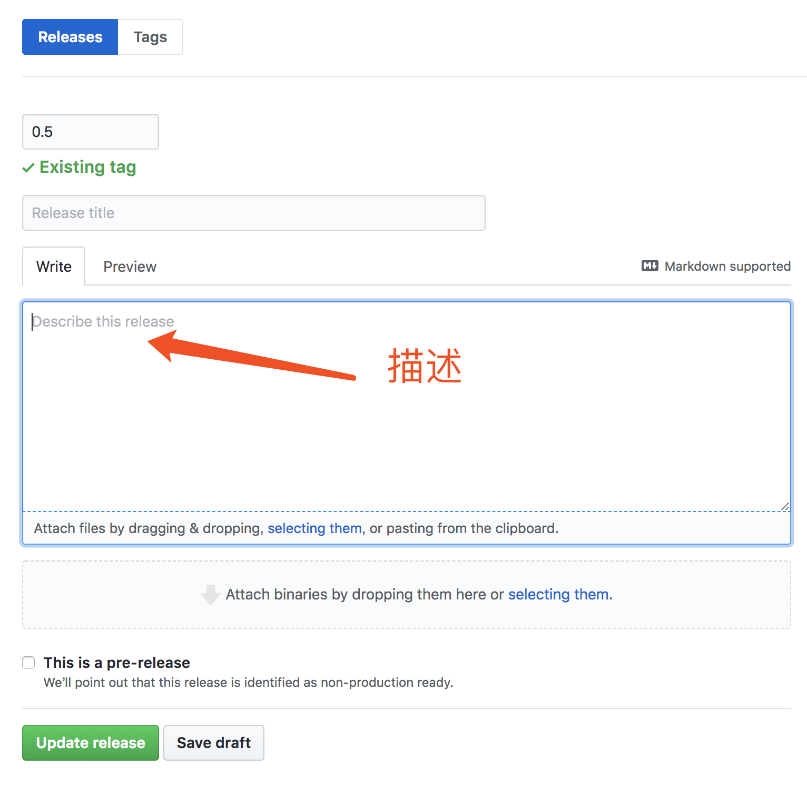

# LinkIDE Snippet 发布注意事项

## 分支说明

- master：主要用于说明注意事项；

- release：**实际代码片段发布分支**。

## 文件后缀

代码片段模板文件请以 `.yaml` 为文件格式后缀。

## 代码片段

编写代码片段的格式与细节可以参考这篇[示例](./example.yaml)。

## 目录结构

release 分支下的目录结构**不做规定**，可根据需要自行组织。

> 目前 LinkIDE 官方支持框架的代码片段统一放在 main 目录下。

## 本地调试

在实际发布版本之前，可以通过本地调试确认所编写的代码片段是否可以顺利加载进IDE。

具体调试方法为：在计算机本地当前用户目录下的 `$USER$/.linkide/snippets_local` 目录中放置待调试模板文件。

IDE在检查 snippet 更新时，首先会去上述目录及子孙目录中检查是否存在 yaml 文件：

- 如果有，则进入调试模式，即不执行后面的联网更新检查，以 `snippets_local` 目录下的 yaml 文件作为代码片段模板文件加载；

- 如果没有，则正常联网检查更新。特别的是，如果上一次检查更新是调试模式，则这一次恢复正常更新必定会拉取 github 上最新更新加载进IDE。

因此建议，**当需要调试时，建立上述文件夹并放入文件；当不需要调试时，重命名 `snippets_local` 目录为其他名称即可正常联网更新**。

## 发布版本

当有新的代码片段版本需要发布时，**先在 release 分支上打 tag ，再将该 tag 发布为 release 版本**。

IDE 更新时，会下载**最新的 release 版本**做更新。

## 发布版本的描述

如果某个代码片段版本的更新比较重大需要用户知晓，可以在发布 release 版本时加上**描述**。

- 有描述的 release 将会在 IDE 更新时**以通知提醒框的形式提示用户**，通知提醒框里将会显示描述内容；

- 没有描述的 release 版本在 IDE 更新时则不会给予用户任何提示。

